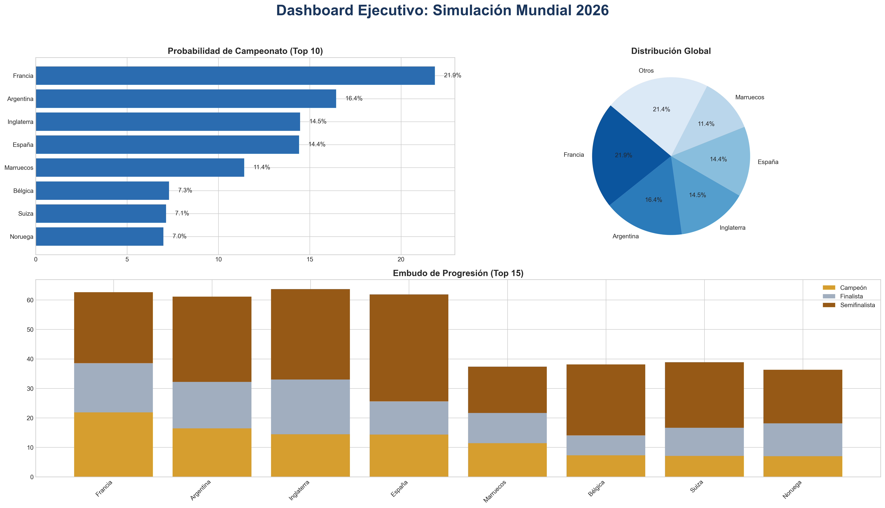

# Resumen Ejecutivo

## Conclusiones Principales
1. **El gran favorito** es **Francia** con una probabilidad de ganar la copa del **21.9%**.
2. Existe una competencia reñida en el Top 3.
3. El uso de Machine Learning + Monte Carlo demuestra una ventaja matemática predictiva.

## Dashboard de Métricas

## Top 5
| Pais       |   Campeon |   Finalista |   Semifinalista |   Campeon % |   Final % |   Semifinal % |
|:-----------|----------:|------------:|----------------:|------------:|----------:|--------------:|
| Francia    |     10925 |       19296 |           31304 |       21.85 |     38.59 |         62.61 |
| Argentina  |      8220 |       16109 |           30566 |       16.44 |     32.22 |         61.13 |
| Inglaterra |      7237 |       16498 |           31838 |       14.47 |     33    |         63.68 |
| España     |      7207 |       12821 |           30940 |       14.41 |     25.64 |         61.88 |
| Marruecos  |      5704 |       10841 |           18696 |       11.41 |     21.68 |         37.39 |
